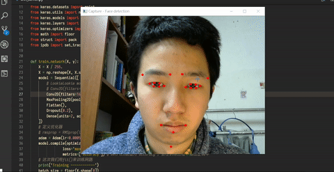

# eye_mouse
a simple cnn project of eye-tracking mouse

It runs on the windows x64 platform.
The program has two parts: 
* c++ frontend: grabbinng images from a webcam(yes a webcam is needed), and controlling the cursor
* keras backend: dealing with CNN things.

It is inspired from [lookie lookie](https://github.com/cpury/lookie-lookie)

and just like lookie lookie, it needs 20 initial trains, and then it can predict where you are looking at, and move cursor there.

